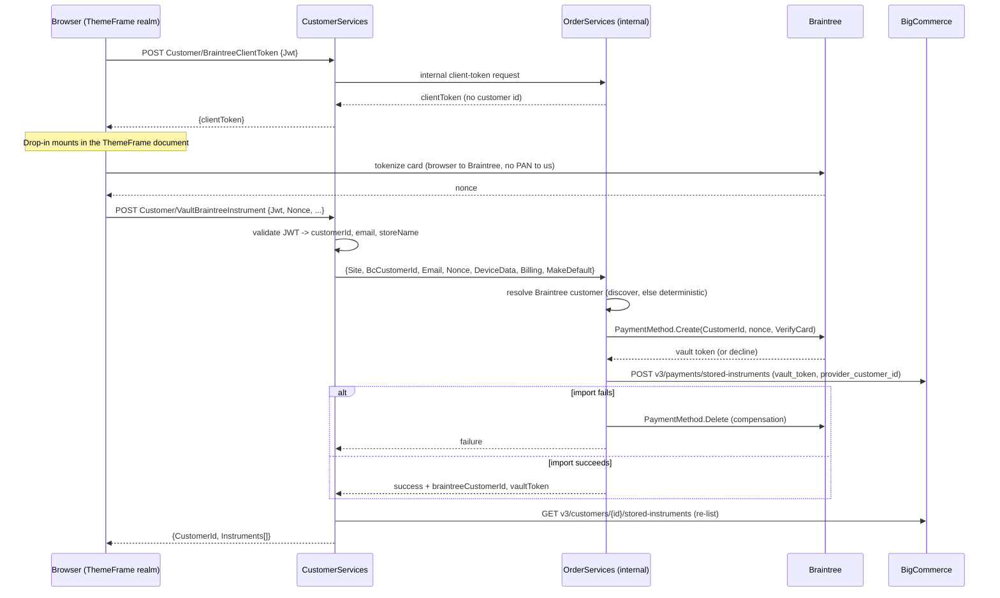

# Payment Methods: parallel Braintree add-card page (vault + BigCommerce import) — Design

- **Date:** 2026-09-10
- **Status:** Approved (brainstormed with THaverman)
- **Page:** `apps/storefront/src/pages/PaymentMethods/` (second route, same page component)
- **Relationship to other specs:** does **not** supersede
  `2026-09-01-payment-methods-add-card-hosted-form-design.md`. That design is shipped and
  stays exactly as it is. This spec adds a **second, flag-gated route** so the two add-card
  mechanisms can be compared side by side. `2026-08-26-payment-methods-add-card-design.md`
  remains superseded, but its §4 spike evidence and its `dropin.ts` module are reused here.
- **Research basis:** the 2026-09-09 deep-research run (9 readers, 2-lens adversarial
  verification). Claims below are marked **verified**, **contested** or **assumed**.

## 1. Decision summary

A signed-in customer adds a card from the account page **with no cart**, the card lands in
BigCommerce's stored-instrument list, and it is chargeable at BigCommerce checkout.

The mechanism ("option 3" in the 2026-09-09 options analysis):

1. Braintree **Drop-in** collects the card inside the ThemeFrame iframe realm and returns a
   nonce. Our page never touches PAN or CVV.
2. Our backend vaults that nonce into Braintree against the customer's **existing** Braintree
   customer record when one can be discovered, and a deterministic one otherwise.
3. Our backend then **imports** the resulting Braintree token into BigCommerce via
   `POST /v3/payments/stored-instruments` (`vault_token` + `provider_customer_id`), which is
   the only documented server-side way to register an externally vaulted token against a BC
   customer.
4. The portal re-renders from BigCommerce's refreshed list, so BC remains the single source
   of truth for what the customer sees.

Why this instead of the shipped hosted form: BigCommerce's stored-card hosted form is
checkout infrastructure and only works when the session has an active cart (spec
`2026-09-01…` §2.9). There is no cart-free, PCI-neutral path into BC's vault from the account
page using that form. Braintree's own SDK has no such dependency.

**Chosen shape, in one line:** flag-gated parallel route, production quality, hidden from the
nav; the winner gets folded into the single `/payment-methods` page as a follow-up and the
loser's dialog is deleted then.

## 2. Go/no-go gate (must pass before any code)

**The design is void if BigCommerce's configured Braintree gateway is a different Braintree
merchant than the one our backend holds credentials for.** In that case the import in step 3
would register a token BC's gateway cannot charge: the card would appear in the list and then
fail at payment time, which is worse than not shipping.

### 2.1 GATE RESULT — sandbox PASSES (verified 2026-09-10)

Verified live on `sandbox.storesupply.com`, signed in as the test account with a two-item cart,
read-only, no order placed. `GET /api/storefront/payments/braintree` returns the method with
its Braintree `clientToken`; decoded, it reads:

| Field | Value |
| --- | --- |
| `merchantId` | **`7p3bsm9pq3dccypd`** |
| `environment` | `sandbox` |
| `merchantAccountId` | **`storesupplywarehouse`** |
| `clientApiUrl` host | `api.sandbox.braintreegateway.com` |

**BigCommerce's own `braintree` method tokenizes against exactly the merchant our backend holds
credentials for** (`GuestVault:Braintree` in Testing, and the legacy `Braintree` sandbox block,
are both `7p3bsm9pq3dccypd`). The same token also surfaced on `braintreepaypal`,
`braintreepaypalcredit` and `applepay`, so the whole Braintree family on this store points at
one merchant.

Bonus confirmation for §6.2 step 2: the `merchantAccountId` BigCommerce settles through,
`storesupplywarehouse`, is precisely the `GuestVault:MerchantAccounts` sandbox name for this
brand. So passing that value as `VerificationMerchantAccountId` puts our card verification on
the same merchant account, and therefore the same currency and AVS/CVV rules, that BigCommerce
uses at checkout.

**Reusable technique:** the decisive check is one authenticated storefront GET,
`/api/storefront/payments/braintree`, not a checkout-page scrape. Re-runnable per store and per
environment in seconds.

**Still open: production.** Both production Braintree config blocks are `x876bp8kkc6bdwzx`, and
production's BigCommerce gateway has **not** been checked. Run the same GET against the
production storefront while signed in with a cart before go-live. Sandbox passing does not
license a production release.

**Downgraded, not resolved.** The contested claim below ("BigPay vaulting creates no
Braintree-side tokens") is now weakly supported: BigCommerce mints its card nonces on
`7p3bsm9pq3dccypd`, and a nonce minted on that merchant can only become a payment method in
that merchant's vault. That makes Braintree-side records the likely outcome of a
save-card-at-checkout, though it remains an inference: BigCommerce's server could consume the
nonce for a single transaction without vaulting. Identity discovery (§7 step 1) is what settles
it empirically on the first customer with order history, and the design degrades cleanly either
way.

Related, also unresolved and **contested**: whether BC-saved cards exist as Braintree
Customer/PaymentMethod records at all. A checkout spec (2026-07-16 §1) asserts "no tokens
ever appear in the merchant's Braintree vault (merchant-confirmed)", but that claim is
single-source, reversed the previous day's opposite assertion, and names no merchant,
environment or order inspected. BigCommerce's own documentation reads the other way: single
DELETE "removes the instrument from our system **and the payment gateway's vault**", import
"does not add instruments to the provider's vault; it only adds already vaulted instruments",
and Braintree is the one gateway whose billing-address updates propagate to the provider.
This spec does not depend on resolving it: identity **discovery** benefits if BC-created
records exist, and falls back cleanly if they do not.

## 3. Verified constraints this design is built on

| Constraint | Status | Source |
| --- | --- | --- |
| Braintree's JS SDK must execute **inside** the ThemeFrame iframe realm; driven from the parent realm `dropin.create()` hangs forever with no error (framebus listens on the wrong window) | verified by spike 2026-08-26 | `2026-08-26-…-design.md` §4; decision `6a8f841404455ad7711d85a6` |
| checkout-sdk's stored-card hosted form is the **opposite**: top realm only | verified by spike 2026-09-01 | `2026-09-01-…-design.md` |
| BC's `POST /v3/payments/stored-instruments` accepts `instrument.vault_token` + `instrument.provider_customer_id` + `payment_method_id`, does **not** validate with the gateway, does **not** vault | verified (docs + our own code) | BC stored-instruments guide; `BigCommerceStoreInstrument.cs:65-95` |
| No BC read surface returns a gateway customer id or vault token; `provider_customer_id` is request-only | verified | BC customers/payments stored-instrument schemas |
| Braintree tokens cannot be re-parented (`PaymentMethod.Update` has no `CustomerId`), so attaching to a specific customer requires vaulting a **new** nonce | verified | Braintree docs + SDK 5.27.0 |
| `FailOnDuplicatePaymentMethodForCustomer` (81763) needs braintree_dotnet **5.28.0+**; backend pins **5.27.0** | verified | `Ssw.MicroServices.OrderServices.csproj:9` |
| `PaymentMethod.Create` returns customer-id errors on `result.Errors` (93104 required, 93105 invalid), not as exceptions | verified | Braintree docs + SDK source |
| Nonces are single-use, 3-hour TTL (93107 reuse, 93108 unknown/expired) | verified | Braintree docs |
| The Current Customer JWT yields `customer.id`, `customer.email` and nothing else identity-wise; store hash/name come from our own config | verified | `CurrentCustomerJwtValidator.cs` |
| JWT TTL is **15 minutes**, not ~15s as older notes said; no `jti`, so it is replayable for its lifetime | verified | BC current-customer docs |
| `StoreSecrets` carries only a StoreSupply entry per environment; other brands fail `UnknownStore` today | verified | CustomerServices `appsettings*.json` |
| `GuestVault:MerchantAccounts` has per-brand entries (`storesupplywarehouse_instant` etc.) and **none for Preferred** | verified | OrderServices `appsettings.json` |
| The backend already models and POSTs the BC import; it is reachable only from migration services, with no `[Authorize]` and no customer scoping | verified | `BigCommercePaymentInstrumentDataService.BulkStoredInstruments` |

## 4. Architecture

### 4.1 Realm inversion (the highest-risk detail)

The shipped hosted-form dialog **escapes into the parent document** because checkout-sdk
demands the top realm. This dialog must do the reverse: the Drop-in **container element must
live in the ThemeFrame document**, and Drop-in must be created through that document's
`defaultView`. Getting this backwards produces a silent infinite hang in either direction,
with no console error, which is exactly how the August spike and the September incident both
presented.

`dropin.ts` from commit `e434e41d` already encodes this correctly and is restored verbatim:
it injects the pinned CDN script into `iframeDocument.head`, reuses an existing tag, rejects
on load error, and calls `iframeDocument.defaultView.braintree.dropin.create(...)`. The
ThemeFrame document comes from `themeFrameSelector` (`@/store/selectors`).

### 4.2 No duplicated page folder

The new route renders the **same** `PaymentMethods` component with a variant prop. List,
rows, delete, set-default, billing prefill and all error copy are therefore shared and
provably identical across the two routes, which is what makes the side-by-side comparison
meaningful rather than a comparison of two different pages.

```
variant="hostedForm" (default, today's behavior)
  gating: getVaultAccess() VAT scrape + hasActiveCart()
  dialog: components/AddPaymentMethodDialog.tsx   (parent document, top realm)

variant="braintree" (new)
  gating: getBraintreeClientToken() probe, NO cart query at all
  dialog: components/AddPaymentMethodBraintreeDialog.tsx  (ThemeFrame document, iframe realm)
```

Folding in later is deleting the losing dialog plus the prop.

### 4.3 Service split, and where the Braintree credentials live

**Decision: CustomerServices holds no Braintree credentials and gains no Braintree
dependency.** It calls an internal-only OrderServices endpoint over the hop the deleted
bridge used (`OrderServicesVaultClient` → `Internal/CustomerVault/*`).

Rationale is PCI scope, not convenience: OrderServices already holds Braintree merchant
credentials and already vaults and charges with them, so it is already a system component
that can affect the cardholder data environment. Adding the SDK and keys to CustomerServices
would pull a second, internet-facing service into that same scope for no functional gain.
See §8.

| Owner | Responsibility |
| --- | --- |
| **CustomerServices** (public, gateway-routed) | JWT validation, request shape, IP + per-customer rate limits, error mapping, and the re-list that returns the refreshed card list. Already owns the list projection and the ownership guard. |
| **OrderServices** (internal only, **not** gateway-routed) | One atomic card-touching unit: resolve the Braintree customer, `PaymentMethod.Create`, the BC import, and the compensating delete if the import fails. |

Compensation must sit next to the Braintree call, so those two steps are never split across
services.

The old bridge earned a fair criticism that `SetDefaultStoredInstrument` returned 502 whenever
OrderServices was unreachable. That happened because it made an OrderServices write
authoritative for a BigCommerce-only operation. This design does not: listing, delete and
set-default stay pure BC proxies in CustomerServices, and only the new vault action needs the
hop, so an OrderServices outage degrades exactly one button instead of the page.

## 5. Portal design

### 5.1 Route and gating

`routeList.ts` gains, after `/payment-methods`:

```ts
{
  path: '/payment-methods-braintree',
  name: 'Payment methods (Braintree)',
  wsKey: 'paymentMethodsBraintree',
  isMenuItem: false,                     // reachable for testing, never in the nav
  permissions: accountSettingPermissions,
  isTokenLogin: true,
  idLang: 'global.navMenu.paymentMethodsBraintree',
},
```

`getAllowedRoutesWithoutComponent` gates it on everything `/payment-methods` requires
(`platform === 'bigcommerce'`, `window.BC_CONTEXT?.paymentMethods` present, not agenting)
**plus** the new flag `window.BC_CONTEXT?.paymentMethodsBraintree?.enabled`. Absent flag means
the route does not exist, so customers cannot reach it before you flip it in the theme.

`routes/index.tsx` maps the path to the same lazy `PaymentMethods` component with
`variant="braintree"`.

`index.d.ts` gains the `paymentMethodsBraintree?: { enabled: boolean }` member on `BC_CONTEXT`.
No new `apiBase` or `appClientId`: both routes reuse `BC_CONTEXT.paymentMethods`.

### 5.2 Page variant prop

`PaymentMethods` takes `variant?: 'hostedForm' | 'braintree'`, defaulting to `'hostedForm'`
so the existing route and every existing test are untouched.

- `variant === 'hostedForm'`: today's behavior verbatim, including the `activeCart` query, the
  needs-cart copy and the `vaultAccess` link-out on error.
- `variant === 'braintree'`: the `activeCart` and `vaultAccess` queries **do not run**
  (`enabled: false`), so no cart request is made at all. Gating comes from a
  `['braintreeClientToken', customerId]` query; success renders the Add card button, error
  renders no affordance, exactly the probe pattern Gen-1 used so Preferred self-gates with no
  theme change.

Empty-list copy uses `paymentMethods.addCard.emptyList` whenever the add affordance is
available on either variant, and `paymentMethods.empty` otherwise.

### 5.3 `dropin.ts` (restored, page-local)

Restored from `e434e41d` unchanged: `DROPIN_SCRIPT_URL` pinned to
`https://js.braintreegateway.com/web/dropin/1.44.1/js/dropin.min.js`, `createDropin(iframeDocument,
container, clientToken)`, `DropinInstance` with `requestPaymentMethod()` and `teardown()`,
`dataCollector: true`.

Two additions:

- Wrap `createDropin` in the same 20-second timeout the hosted-form path uses
  (`createStoredCardFormWithTimeout`), tearing down a late arrival, so a stalled script or a
  network hang surfaces as an error alert rather than an endless spinner.
- Add subresource integrity **if** Braintree publishes a hash for that bundle; check at
  implementation time and record the outcome either way (see §8).

### 5.4 `components/AddPaymentMethodBraintreeDialog.tsx`

Renders in the ThemeFrame document, following whatever `B3Dialog` already does on this page
(the delete-confirmation dialog works in-frame today). The Drop-in container is a plain `div`
inside the dialog body; it **must** belong to the ThemeFrame document.

Body: a Drop-in mount point for the card fields, then the existing MUI billing-address form
reused from the hosted-form dialog with `getBillingCountries()` / `getBillingPrefill()`
(country and state dropdowns, floating-label fix, theme-CSS reset all inherited).

Submit: `requestPaymentMethod()` for the nonce and device data, then
`vaultBraintreeInstrument({ nonce, deviceData, billing, makeDefault })`. On success the parent
invalidates `['storedInstruments', customerId]`, closes, and snackbars
`paymentMethods.addCard.success`.

The nonce is never logged. Neither is device data.

### 5.5 `api.ts` additions

```ts
export const getBraintreeClientToken = async (): Promise<string> => {
  const { clientToken } = await fetchJson('BraintreeClientToken', {});
  return clientToken;
};

export const vaultBraintreeInstrument = ({
  nonce,
  deviceData,
  billing,
  makeDefault = false,
}: {
  nonce: string;
  deviceData?: string;
  billing: BillingFormValues;
  makeDefault?: boolean;
}): Promise<StoredInstrumentsResponse> =>
  post('VaultBraintreeInstrument', {
    Nonce: nonce,
    // Omit DeviceData entirely when collection failed; an empty string is not the same thing.
    ...(deviceData ? { DeviceData: deviceData } : {}),
    MakeDefault: makeDefault,
    Billing: {
      FirstName: billing.firstName,
      LastName: billing.lastName,
      Company: billing.company || null,
      Address1: billing.address1,
      Address2: billing.address2 || null,
      City: billing.city,
      StateOrProvinceCode: billing.stateOrProvinceCode,
      PostalCode: billing.postalCode,
      CountryCode: billing.countryCode,
      Phone: billing.phone || null,
      Email: billing.email,
    },
  });
```

**Transport type widening required.** `fetchJson`/`post` currently take
`body: Record<string, string>`, which cannot express a nested `Billing` object or a boolean
`MakeDefault`. Widen both to `Record<string, unknown>`. The three existing callers pass string
maps and are unaffected, but this is a signature change to shared page code, so it belongs in
its own commit ahead of the feature work.

`PaymentMethodsErrorKind` gains `'declined'` for HTTP 422, so the dialog can distinguish a
card problem (`paymentMethods.addCard.failed`) from a system problem
(`paymentMethods.errors.generic`). No `declineReason` field: per §9 the reason never crosses
the wire.

Request bodies stay PascalCase per the CustomerServices contract (`Jwt`, `Nonce`,
`DeviceData`, `Billing`, `MakeDefault`), matching the existing `Token` casing.

### 5.6 The flow



## 6. Backend contract

Both public actions live on `CustomerCardsController` under the existing `Customer/[action]`
convention, so the YARP catch-all `/customers/Customer/{**catch-all}` already routes them and
**no gateway change is required**.

### 6.1 `POST /customers/Customer/BraintreeClientToken`

Body `{ Jwt }`. Returns `200 { clientToken }` (camelCase wrapper, matching the old
`VaultClientToken` shape).

The token is minted **without** a customer id, deliberately. A customer-scoped client token
would let Drop-in enumerate and manage the shopper's Braintree-side cards through
`vaultManager`, and BigCommerce's list is the source of truth here. It would also make the
token a bearer credential for that customer's vault.

This endpoint doubles as the gating probe: any error means the portal renders no add
affordance.

### 6.2 `POST /customers/Customer/VaultBraintreeInstrument`

Body `{ Jwt, Nonce, DeviceData?, Billing{ FirstName, LastName, Company?, Address1, Address2?,
City, StateOrProvinceCode, PostalCode, CountryCode, Phone?, Email }, MakeDefault? }`.

Returns `200 { CustomerId, Instruments[] }`: the **refreshed** BigCommerce list, matching what
set-default and delete already return so the portal re-renders from server truth.

Server sequence:

1. Validate the JWT. Customer id comes **only** from the JWT, never from the body. (The old
   IAT design's central flaw was a caller-controlled `customer_id`, which let any valid
   session attach a card to any customer in the store.)
2. Resolve `GuestVault:MerchantAccounts:{storeName}`. **Missing means fail closed before
   touching Braintree**, so a brand with no merchant account cannot settle into another
   brand's. Preferred has no entry and must therefore 502 rather than default.
3. Resolve the Braintree customer (§7).
4. `PaymentMethod.Create` with `CustomerId`, `PaymentMethodNonce`, the billing address, and
   `Options { VerifyCard = true, VerificationMerchantAccountId = <per-brand>,
   FailOnDuplicatePaymentMethod = false, MakeDefault = <request> }`.
   `FailOnDuplicatePaymentMethod` stays **false**: a card BigCommerce already vaulted at
   checkout on the same merchant would otherwise block the add, and the per-customer variant
   of that flag needs SDK 5.28.0+.
5. Import into BigCommerce: `POST /v3/payments/stored-instruments` with
   `payment_method_id: "braintree.credit_card"`, `customer_id`, `currency_code`,
   `default_instrument`, `billing_address`, and `instrument { vault_token, provider_customer_id,
   type: "credit_card", brand, last_4, iin, expiry_month, expiry_year }`.
6. **If step 5 fails after step 4 succeeded, delete the Braintree payment method**, log both
   outcomes, and return 502. Without this every failed import leaves a live orphan token that
   nothing owns, and retries accumulate more.
7. Re-list from BigCommerce and return.

Status mapping, matching the portal's existing error kinds:

| Status | Meaning | Portal kind |
| --- | --- | --- |
| 400 | `missing_jwt` / `missing_nonce` | (thrown before display) |
| 401 | JWT invalid or expired | `sessionExpired` |
| 422 | Card failed verification | `declined` |
| 429 | Rate limit (IP or per-customer) | `rateLimited` |
| 502 | Braintree, BigCommerce or internal-hop failure, including a compensated import failure | `upstream` |

### 6.3 Internal OrderServices endpoint

`{Site, BcCustomerId, Email, Nonce, DeviceData?, Billing, MakeDefault}` in; outcome plus
`BraintreeCustomerId` and `VaultToken` out, with a decline code on 422-equivalent outcomes.

Two hardening requirements, both because OrderServices controllers carry **no `[Authorize]`
attribute** today:

- The route must not appear in any gateway route table, in any environment. This is the same
  call commit `500f81af` made when it internalized the old vault route.
- The handoff must specify how the hop authenticates. Network placement is currently doing all
  of the work, and that should be a stated decision rather than an accident.

## 7. Braintree customer identity resolution

Ordered. First match wins.

**Step 1, discovery.** Recover the Braintree customer id BigCommerce itself uses for this
shopper. The internal business service's `txndetails` response already carries
`CustomerDetails.Id`, and `TransactionDetailsResponse.cs:23` already deserializes it and
discards it. So: find a past Braintree-paid order for this BC customer, take its payment
transaction id, call `txndetails`, read `CustomerDetails.Id`. On a hit, **write the result into
the mapping table**, so discovery is paid once per customer and every later add is a single
mapping read.

Do not assume a format. Whatever BigCommerce chose is what we use verbatim.

**Step 2, deterministic fallback.** `bc-{site.ToLowerInvariant()}-{bcCustomerId}`, then
`Customer.Find(id)`:

- Found: use it.
- `NotFoundException`: `Customer.Create(Id = …, Email, FirstName, LastName)` and use it.
- **Error 91609 after a NotFound**: means another party owns that id (a race, or a leftover
  from August bridge testing). **Re-read and fail closed.** Do **not** treat 91609 as success:
  the deleted bridge did exactly that with no ownership check
  (`BraintreeCustomerVaultGateway.cs:37-43`), which would silently attach one shopper's card to
  another's vault record.

The site segment is required: BC customer ids repeat across the four stores that share one
Braintree gateway, so a site-less `bc-{id}` would collide across brands. (The 2026-07-17 guest
spec reserved the site-less form; the 2026-08-25 spec said a GUID; the shipped bridge code used
the site-scoped form. Site-scoped is correct and is what this spec requires.)

**Step 3, mapping.** Persist `(Site, BcCustomerId) -> BraintreeCustomerId` with a unique index
on the pair, plus which step produced it. The email the old internal payload dropped is
forwarded now, so created customers are identifiable in the Braintree control panel.

Explicitly **not** used: `Customer.Search` by email. It returns 0..n, email is not unique in a
Braintree vault, and the results would include disposable `{32hex}_g` guest-checkout customers
and legacy Recharge migration records. Attaching to one of those would commingle ownership
models for no benefit.

## 8. PCI and security

**What does not change.** With Drop-in the PAN and CVV are entered in Braintree-hosted iframes
and posted browser-direct to Braintree. Our page never reads them and our servers never
receive them; what reaches the backend is a single-use, 3-hour nonce that is worthless without
our merchant credentials. This is the same posture as the shipped hosted form, and materially
better than the two raw-card paths in this space (BigCommerce's own native
`account.php?action=add_payment_method` page, and the IAT attach fallback in §11), both of
which put a real PAN through a merchant-controlled form. The SAQ letter itself is the
acquirer's and QSA's determination, not ours.

**What does change, and must be handled:**

1. **A backend service with vaulting credentials enters the flow.** In the shipped hosted-form
   path our services are entirely outside the card path. Here, OrderServices creates and
   deletes payment methods with Braintree merchant credentials. No cardholder data lands
   there, so this is not CHD storage, but that service is in scope for access control, key
   management, logging and patching. §4.3 confines this to the one service that already has
   these credentials rather than spreading it.
2. **Open question for the attestation owner, not an engineering call:** is there a documented
   CDE boundary, and does it name OrderServices and its Braintree credentials? If yes, we
   extend existing documentation and inherit existing controls. If nobody has asked, this
   endpoint is where the question surfaces, and it surfaces on a customer-facing account
   endpoint rather than a background checkout job. Aggravating context, already flagged twice
   in the team's own memory notes as open: the production Braintree keypair is committed in
   `appsettings.json`, so it lives in the repository, on every clone, in CI and in every repo
   backup, each of which becomes a connected-to system by the same test. That exposure exists
   today, independent of this work. Run this question in parallel with the §2 gate; it blocks
   neither the spec nor the design.
3. **Script inclusion on a page hosting card fields.** Drop-in is a third-party script injected
   at runtime into the ThemeFrame document. PCI DSS v4 requirements 6.4.3 and 11.6.1,
   mandatory since March 2025, target exactly this. Mitigations: the version stays pinned
   (1.44.1); check whether Braintree publishes an integrity hash and use SRI if so; record the
   script in whatever payment-page script inventory the org keeps. This applies to the shipped
   hosted-form page as well, so it is an existing gap to close rather than one this design
   introduces.
4. **`VerifyCard` makes this endpoint a card-testing oracle**, billing a live verification to
   our gateway per attempt. Mitigations are requirements, not suggestions: a **per-customer
   rate limit** of roughly 5/hour on top of the existing 20/60s IP limit, and the single
   generic decline message of §9 so the endpoint is not a useful signal channel either.
5. **Replay window.** The JWT is valid 15 minutes and carries no `jti`, so a captured request
   is replayable for that long. The per-customer rate limit is also the mitigation here.

**Stored data.** Braintree token, Braintree customer id, brand, expiry, last four and BIN.
All are either non-CHD or within permitted truncation (6 + 4). No verification value is ever
returned to us in this flow. The nonce and device data stay out of logs.

## 9. Error UX

**Every server-side verification failure shows one generic message**,
`paymentMethods.addCard.failed` ("We couldn't save this card. Check the card details and
billing address, or try a different card"). The full processor response code and gateway
rejection reason go to Seq only and never cross the wire.

The reasoning is worth recording, because the obvious instinct is to map Braintree's rich
decline detail to specific copy. Drop-in already catches client-side the cases a customer can
act on: number format, expiry, CVV presence. A failure that reaches the server is therefore
almost always a genuine processor decline or gateway rejection, and those are precisely the
responses that make a verification endpoint useful to someone testing stolen cards. AVS is the
sharpest example: "check your billing address" confirms the card itself is live, which is what
carding probes for. As a bonus, both routes now fail identically, so the side-by-side
comparison is not muddied by different failure copy.

| Case | Behavior |
| --- | --- |
| Client-token probe fails | No Add card button; the list still renders. Preferred self-gates this way. |
| Drop-in script or `create` fails or stalls 20s | Error alert in the dialog using a new `addCard.braintree.formError` (no link-out wording), then teardown. |
| Nonce expired or consumed (93107/93108) | `errors.generic`, and reset Drop-in so a retry is clean. |
| Card declined / verification failed (422) | `addCard.failed`, dialog stays open, Drop-in reset for another attempt. |
| Import failed after a successful vault (502) | `errors.generic`. No card appears, and because compensation deleted the token the retry is clean rather than duplicating. |
| Rate limited (429) | Existing `paymentMethods.errors.rateLimited`. |
| Session expired (401) | Existing `paymentMethods.sessionExpired`. |
| Masquerading rep | Route hidden entirely, exactly as `/payment-methods` is: the JWT identifies the rep, not the buyer. |

Success invalidates `['storedInstruments', customerId]`, closes the dialog and snackbars
`paymentMethods.addCard.success`.

## 10. i18n

Two new keys only; everything else is reused:

- `global.navMenu.paymentMethodsBraintree` = "Payment methods (Braintree)" (required by the
  route shape even though `isMenuItem: false`).
- `paymentMethods.addCard.braintree.formError` = "The card form couldn't be loaded. Please try
  again." (The existing `addCard.formError` ends with native-page link-out wording that does
  not apply here.)

Reused as-is: `addCard.button`, `addCard.dialogTitle`, `addCard.save`, `addCard.cancel`,
`addCard.failed`, `addCard.success`, `addCard.requiredField`, `addCard.billingTitle`, every
`addCard.billing.*`, `errors.generic`, `errors.rateLimited`, `sessionExpired`,
`addCard.emptyList`, `empty`.

Drop-in renders its own card-field labels, so `addCard.cardNumber`, `addCard.expiry`,
`addCard.cvv` and `addCard.nameOnCard` are **not** used on this variant. They stay in place
for the hosted-form dialog.

## 11. Fallbacks

In preference order, if the §2 gate fails or option 3 disappoints in live verification.

1. **Deterministic-only identity.** Drop §7 step 1 and always use `bc-{site}-{bcCustomerId}`.
   Same architecture, one fewer read, less coherent vault (our Braintree customer sits
   alongside any BigCommerce-created one). Cheap pivot, hours not days.
2. **Keep today's cart-gated hosted-form page.** Zero work, status quo. Empty-cart customers
   still cannot add a card and still see the honest copy.
3. **Raw-card IAT attach.** `POST payments.bigcommerce.com/stores/{hash}/stored-instruments`
   with `type: "raw_card"` and an instrument access token, which the backend's existing
   `VaultInstrumentToken` already mints (dead code today). Cart-free and needs no Braintree at
   all, which makes it attractive on paper. Two blockers: it puts a real PAN through our own
   form, which is a genuine PCI posture change requiring the §8 item 2 answer first; and the
   IAT mint is **store-scoped, not customer-scoped** (`MintInstrumentAccessTokenAsync(claims.StoreName)`
   never binds a customer id), so the attach body's `customer_id` is caller-controlled and must
   be bound server-side before this is safe to expose.
4. **Link out to BigCommerce's native add-payment-method page.** Cart-free, zero backend work,
   already reachable through the portal takeover carve-out. But it is a raw-card page on
   BigCommerce's DOM and a context switch out of the portal, and this was already declined once
   in favor of honest copy.

## 12. Testing

All portal tests are MSW-mocked; no live calls.

- **Variant selection:** `/payment-methods-braintree` renders the Braintree dialog and
  `/payment-methods` the hosted-form dialog; the Braintree variant fires **no** cart query at
  all (assert the cart module is never called) and no VAT scrape.
- **Route gating:** absent `BC_CONTEXT.paymentMethodsBraintree.enabled` the route is not in the
  allowed list; it never appears in the nav; hidden while agenting.
- **`dropin.ts`:** restore Gen-1's `dropin.test.ts` and extend it. The script tag lands in the
  **ThemeFrame** document head and not the parent, an existing tag is reused rather than
  duplicated, a load error rejects, and the 20s timeout rejects and tears down a late arrival
  (fake timers with `shouldAdvanceTime: true`).
- **Dialog:** billing fields prefill from `getBillingPrefill`; country and state render as
  dropdowns; submit passes the nonce and device data through to `vaultBraintreeInstrument`;
  success invalidates and snackbars; 422 shows `addCard.failed` and keeps the dialog open; 429
  shows the rate-limit copy; a stalled `create` shows the form error.
- **Probe gating:** client-token 200 renders the Add button; an error renders no affordance
  while the list still loads.
- **`api.ts`:** both new calls send PascalCase bodies with a fresh JWT; 422 maps to `declined`;
  the existing 401/404/429/502 mapping is unchanged.
- `fakeThemeFrame` stays a **stub** (`{ body: { style: {} } }` cast), never a real jsdom
  `Document`, per the RTK `immutableCheck` stack-overflow gotcha already logged for this page.
- **Negative control on every new test:** revert the production change and re-run to prove the
  test fails. Planned tests on this page went vacuous three times in one session; this is not
  optional.
- Existing `PaymentMethods` tests must pass unchanged, which the defaulted `variant` prop
  guarantees.

Backend tests belong to the handoff: discovery hit; discovery miss falling through to
deterministic; 91609 after NotFound failing closed rather than adopting; a missing merchant
account failing before Braintree is touched; compensation firing on import failure; the
per-customer rate limit; and no nonce or PAN in any log.

## 13. Live verification, in order

1. **The §2 merchant-account check.** Read-only. Decides go or no-go before any code is
   written.
2. Add a card on the SSW sandbox with an **empty cart** and see it appear in the portal list.
3. **Place a sandbox order paying with that newly added card.** This is the real success
   criterion and the only step that distinguishes option 3 from a parallel-vault design. Until
   it passes, nothing is proven.
4. Same customer, both routes, side by side: compare load time, failure behavior and the
   resulting list entries.

## 14. Out of scope

- Folding the winner into a single `/payment-methods` page and deleting the loser. Follow-up
  once verification passes.
- Removing the cart gate from the hosted-form variant. It stays until the fold-in.
- Non-StoreSupply brands. `StoreSecrets` has only a StoreSupply entry per environment, so other
  brands 401 as `UnknownStore` today; enabling them is backend config, tracked separately.
- Ordergroove subscription repointing to a newly added card.
- Any change to list, delete or set-default behavior.
- Migrating existing BigCommerce-vaulted cards to Braintree-side records. Not possible:
  Braintree tokens cannot be re-parented and we never hold the PAN.

## 15. Implementation-time checkpoints

- Confirm where an unmodified MUI dialog portals in this app. `B3Dialog` already works in-frame
  on this page, so follow it. Regardless of the dialog chrome, **the Drop-in container element
  must belong to the ThemeFrame document**, and the container and the SDK must never be split
  across realms.
- Confirm whether Braintree publishes an SRI hash for `dropin/1.44.1/js/dropin.min.js`; add
  `integrity` if so, and record the answer either way for the §8 item 3 script inventory.
- Confirm the Drop-in bundle loads over the store's CSP. The hosted-form work found that theme
  CSS and CSP both bite in this area; `js.braintreegateway.com` and
  `assets.braintreegateway.com` must both be reachable.
- Verify `knip` is satisfied: every new export needs a consumer or a test.
- Diff lint and test failures against the dev red baseline; do not fix pre-existing redness
  here.
